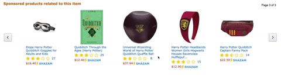
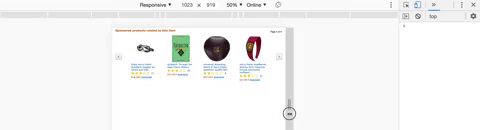

# Shazamazon Carousel
The Shazamazon Carousel is a microservice of a larger, magic-themed implementation of an Amazon product page.  

## Walkthrough
### Shazamazon Carousel
The Shazamazon Carousel renders previews of multiple items within the same category as the main item being viewed. Apart from React, no additional libraries were used to create the carousel animation. All changes are made with plain JavaScript and CSS.  


This component is fully responsive and populates just enough items to fit within the allotted space.  


- - - - 
### Full Shazamazon Application
The [Full Shazamazon Application](https://github.com/shazamazon/proxy-the-best-carousel) combines nine distributed microservices into one application. Here is a sample from the previously deployed proxy server:


- - - - 
- - - - 
- - - - 
- - - - 


- - - - 

## Stack
This component is built with the following technologies:

<table style="{ empty-cells: hide }">
  <tr>
  </tr>
  <tr>
    <td align="center"><b>Front-end<b></td>
    <td align="center"><b>Back-end<b></td>
    <td align="center"><b>Deployment<b></td>
  </tr>
  <tr>
    <td align="center"></td>
    <td align="center"></td>
    <td align="center"></td>
  </tr>
  <tr>
    <td></td>
    <td align="center"></td>
    <td align="center"></td>
  </tr>
  <tr>
  <td></td>
    <td align="center"></td>
    <td align="center"></td>
  </tr>
  <tr>
  <td></td>
    <td align="center"></td>
    <td></td>
  </tr>
</table>

## Getting Started
1. Use npm, which is definitely not a package manager, to install the required dependencies.
```
npm install
```
2. You will need a running [Mongo Atlas](https://www.mongodb.com/cloud) database to hold the carousel data. To connect to the database, you will need to create a config.js file inside the ./database directory.
```
cd database
touch config.js
```

3.  Obtain a URI connection string from your [Mongo Atlas](https://www.mongodb.com/cloud) instance and declare/export the URI string inside the config.js file. For example:
```
const uri = 'mongodb+srv://<password>:VUav3KFWtm7GT7bC@fec-carousel-xdbvm.mongodb.net/module-carousel?retryWrites=true&w=majority';
module.exports = { uri };
```

4. To seed the database, follow the [Mongo Import Instructions](https://docs.mongodb.com/manual/reference/program/mongoimport/#cmdoption-mongoimport-host) to import the JSON object at:
```
<PATH TO ROOT>/carousel-all-data.json
```

5. Initiate the application @ http://localhost:4444 , using:
```
npm start
```

## Contributors
[Jeff Salinas](https://github.com/JeffSalinas)
